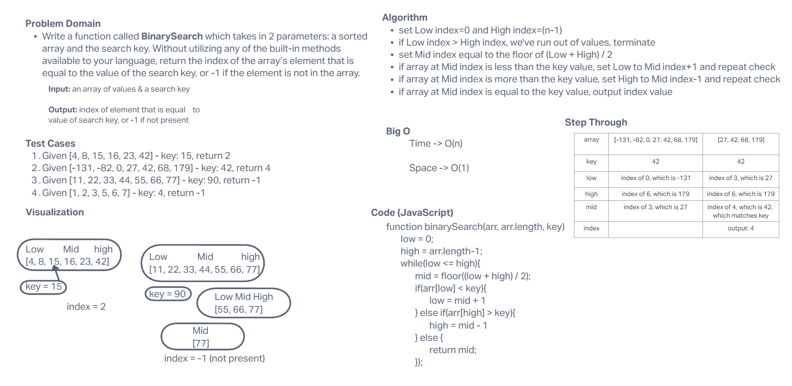

# Array Binary Search

Write a function called `BinarySearch` which takes in 2 parameters: a sorted array and the search key. Without utilizing any of the built-in methods available to your language, return the index of the array’s element that is equal to the value of the search key, or -1 if the element is not in the array.

## Whiteboard Process



## Approach & Efficiency

## Solution

``` JavaScript
function binarySearch(arr, arr.length, key){

  let low = 0;
  let high = arr.length-1;

  while(low <= high){
    let mid = floor((low + high) / 2);

    if(arr[low] < key){
      low = mid + 1
    } else if(arr[high] > key){
      high = mid - 1
    } else {
      return mid;
    }
  };
}
```
