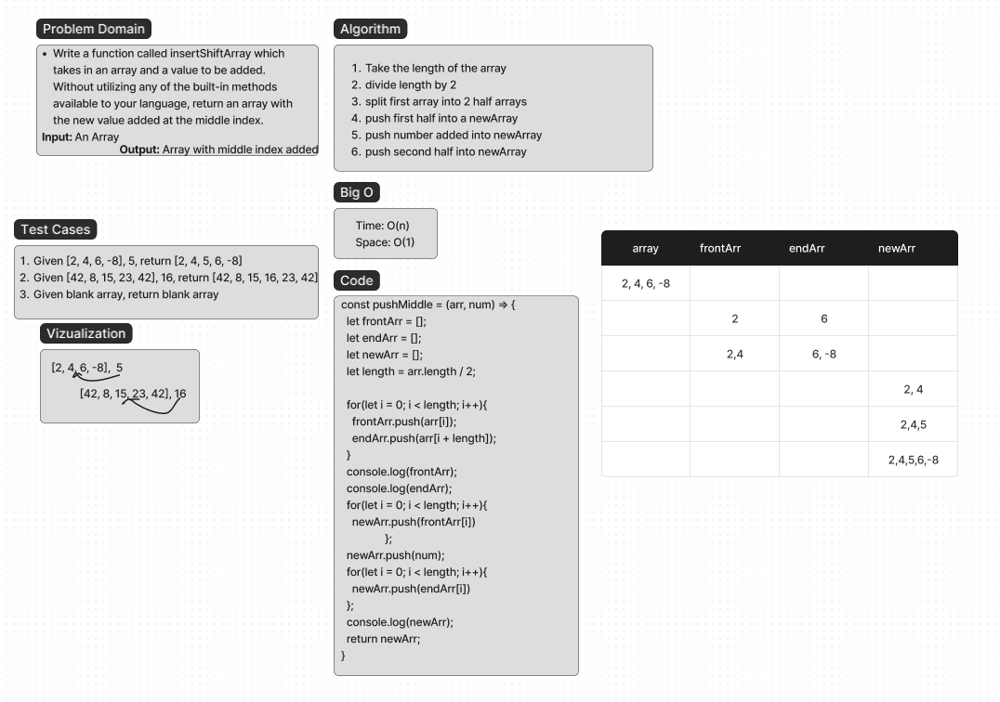

# Challenge Title

Insert-Shift-Array: Write a function called `insertShiftArray` which takes in an array and a value to be added. Without utilizing any of the built-in methods available to your language, return an array with the new value added at the middle index.

## Whiteboard Process



## Approach & Efficiency

The approach on this one was a bit difficult and I am not entirely sure I got it right to begin with! Thanks to Stephen's help, Michael and I eventually got somewhere! The whole plan was to divide the length of the array by 2, getting the mid point. Then we would split the single array into two arrays, a front half, and a back half. Then we push those arrays into a new array, first front half, then the new number, then the back half.

## Solution

``` JavaScript
const pushMiddle = (arr, num) => {
  let frontArr = [];
  let endArr = [];
  let newArr = [];
  let length = arr.length / 2;

  for(let i = 0; i < length; i++){
    frontArr.push(arr[i]);
    endArr.push(arr[i + length]);
  }
  console.log(frontArr);
  console.log(endArr);
  for(let i = 0; i < length; i++){
    newArr.push(frontArr[i])
                };
  newArr.push(num);
  for(let i = 0; i < length; i++){
    newArr.push(endArr[i])
  };
  console.log(newArr);
  return newArr;
}
```
