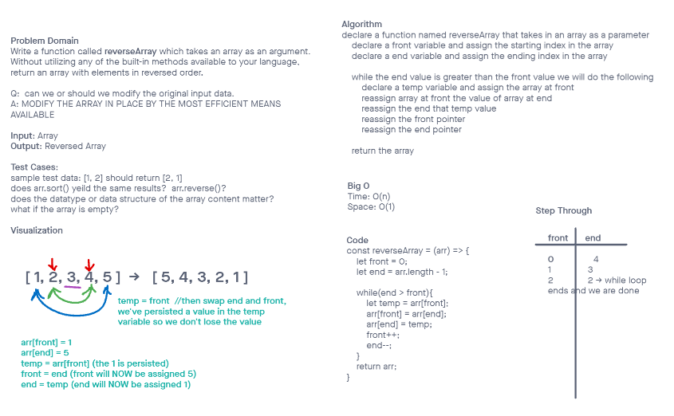

# Challenge Title

Array-Reverse: Write a function called reverseArray which takes an array as an argument. Without utilizing any of the built-in methods available to your language, return an array with elements in reversed order.

## Whiteboard Process



## Approach & Efficiency

I took the approach that Ryan covered in class which seemed very well thought out, taking the first value of the array & storing it, then placing the end value of the array into the first arrays location, and using the stored first array to place it on the end value. The while loop makes sure that this only happens until we run out of values.

## Solution

``` JavaScript
const reverseArray = (arr) => {
    let front = 0;
    let end = arr.length -1;

    while(end > front){
        let temp = arr[front];
        arr[front] = arr[back];
        arr[back] = temp;
        front++;
        end--;
    }
    return arr;
}
```
