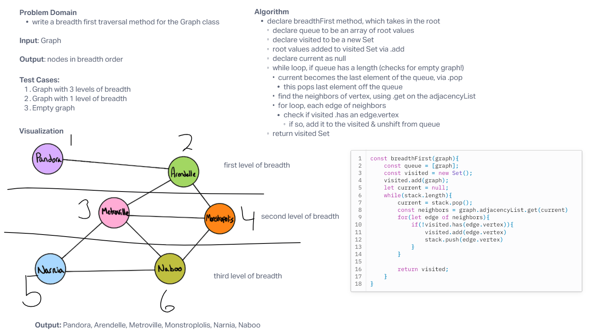

# Graphs - Breadth First Traversal

Write the following method for the Graph class:

- breadth first
- Arguments: Node
- Return: A collection of nodes in the order they were visited.
- Display the collection

## Whiteboard Process

## Approach & Efficiency
<!-- What approach did you take? Why? What is the Big O space/time for this approach? -->

Graph traversal is similar to a tree except we might end up coming to the same node again. For this reason we have to have our visited vs not visited nodes so we don't double up the same nodes. Then we visit all nodes in the first level, travel to the second level, do the same, and continue through all levels.

## Solution
<!-- Show how to run your code, and examples of it in action -->

[Link to Code](./index.js)
