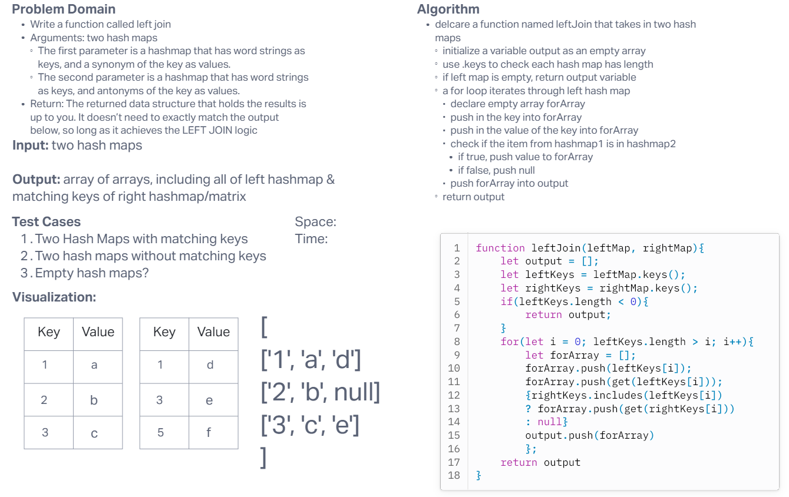

# Code Challenge 33: Hash Map Left Join

Write a function called left join.

- Arguments: two hash maps
- The first parameter is a hashmap that has word strings as keys, and a synonym of the key as values.
- The second parameter is a hashmap that has word strings as keys, and antonyms of the key as values.
- Return: The returned data structure that holds the results is up to you. It doesn’t need to exactly match the output below, so long as it achieves the LEFT JOIN logic

## Whiteboard Process

## Approach & Efficiency
<!-- What approach did you take? Why? What is the Big O space/time for this approach? -->

For this one it seemed very complex but Ryan helped break it down for us. The biggest thing is that we are joining all of the values into the left table, but ONLY if the keys match. First we have to get all the keys from both maps. Once we do so, we will iterate through the left map, checking for all keys to match right map. Any keys that match will be added into the values for the return matrix.

Time: O(n*m)
Space: O(n)

## Solution
<!-- Show how to run your code, and examples of it in action -->

[Link to Code](./index.js)
