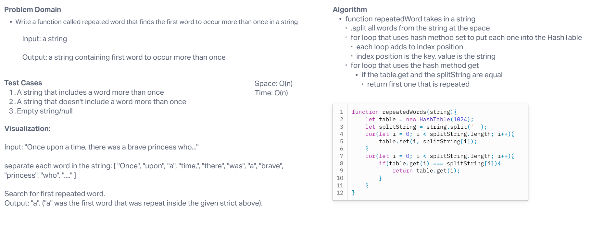

# Code Challenge 31: Hash Map Repeated Word

Write a function called repeated word that finds the first word to occur more than once in a string.

## Whiteboard Process

## Approach & Efficiency
<!-- What approach did you take? Why? What is the Big O space/time for this approach? -->

We tried to take the approach of splitting up the string into an array, then iterating through that array and putting those values into the hashtable. Then we were going to iterate through that array once more and check if the values match any of the hash tables. Now that I'm writing this out - I realize our code won't ever work this way. I think we need to do a table.get before the table.set and see if the value is already in the table - if it is, return it, if not, then add it to table.

Time: O(n)
Space: O(n)

## Solution
<!-- Show how to run your code, and examples of it in action -->

[Link to Code](./index.js)
