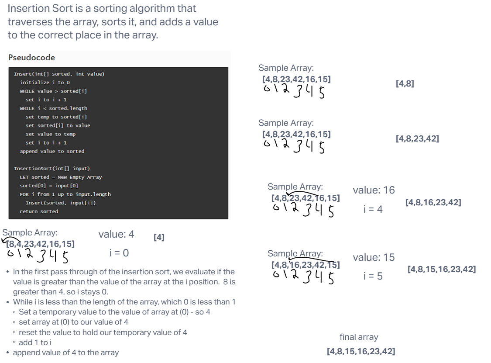

# Insertion Sort

Sort an array by insertion-sort method

## Whiteboard Process

## Approach & Efficiency
<!-- What approach did you take? Why? What is the Big O space/time for this approach? -->

Time: O(N^2)
Space: O(1)

I tried to take the approach that was shown in the pseudocode. First we assign an empty array, then we start to push numbers from the original array into the new array, with the smallest numbers going in first, sorting them from smallest to largest.

## Solution
<!-- Show how to run your code, and examples of it in action -->

[Link to Code](./index.js)
