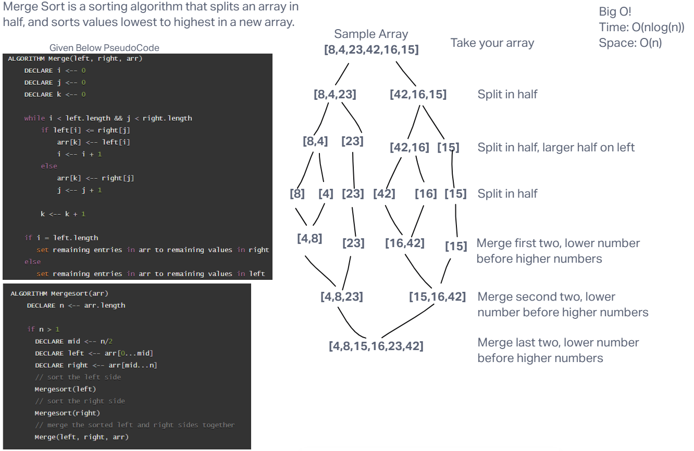

# Merge Sort

Sort an array by Merge Sort method

## Whiteboard Process

## Approach & Efficiency
<!-- What approach did you take? Why? What is the Big O space/time for this approach? -->

Time: O(n*log(n))
Space: O(n)

I started by checking out the pseudocode and trying to tackle down what was happening. As you can see in my visualization, it seems like the arrays get split in half over and over again until all items are individualized, then it starts to merge them together, sorting them by value. Ultimately this seemed like a great idea, and didn't seem to require a new array being made, as we are just reassigning the values to new places in the old array. I couldn't get this to work! I tried as hard as a I could. Eventually I tried a new method slightly different than the pseudocode, but this way creates a new array, which may be less efficient as far as space is concerned but I think it might speed up the time?

## Solution
<!-- Show how to run your code, and examples of it in action -->

[Link to Code](./index.js)
