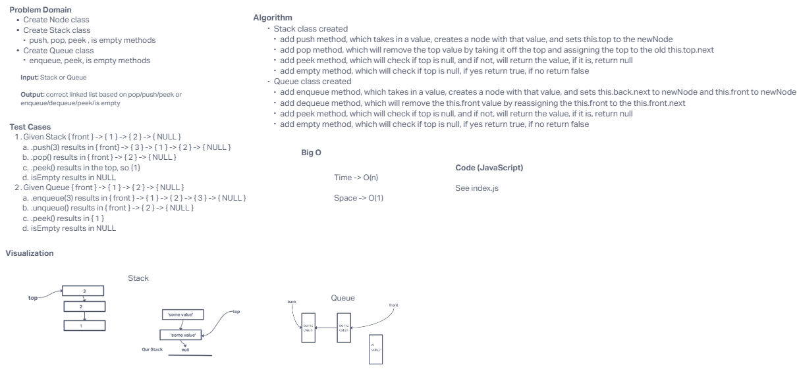

# Stacks & Queues

Using a Linked List as the underlying data storage mechanism, implement both a Stack and a Queue.

## Whiteboard Process

## Approach & Efficiency
<!-- What approach did you take? Why? What is the Big O space/time for this approach? -->

I took the approach that Ryan went over in class, which was very similar to linked list traversal! Using this.front/this.top felt very similar this this.current! Queue having this.back is a super fancy feature that seems like it also might get a little confusing. Otherwise, they felt like specific styles of linked list.

## Solution
<!-- Show how to run your code, and examples of it in action -->

[Link to Code](./index.js)

Our code uses several methods to work with the Stack and Queue classes we created. The Stack and Queue classes connect several nodes together and the nodes hold values. Stack specifically always places one item on top of the other, adding to the top of the Stack (like plates!). We added methods `push(value)` which would add a new value to the top of the Stack. `pop()` will remove the top item from the stack. `peek()` shows you the value of the top item in the stack. `isEmpty()` method returns true if empty and false if not an empty stack! Queue is similar but different!! We added methods `enqueue(value)` to add a new item to the front of the back of the list. `dequeue()` removes the front item from the list. `peek()` shows you the value in the front of the queue. `isEmpty()` returns true if the queue is empty but false if the queue has value!
