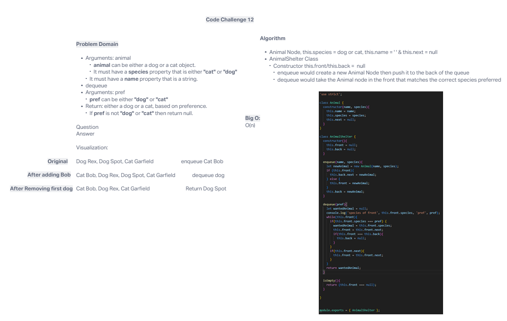

# First in, First out Animal Shelter

Create an `AnimalShelter` class that holds dogs and cats in a queue, using first in first out. There needs to be a `species` property holding `cat` or `dog`. Add `enqueue` and `dequeue` methods.

## Whiteboard Process

## Approach & Efficiency
<!-- What approach did you take? Why? What is the Big O space/time for this approach? -->

Josh C and I took the approach of thinking of the `AnimalShelter` as a `Queue` but with special requirements. Ultimately I think our thought process made sense. Add to back, pull from front, make sure the species preference matches the animal. In theory this seemed fairly doable - but in practice we couldn't get the code to work properly.

## Solution
<!-- Show how to run your code, and examples of it in action -->

[Link to Code](./index.js)

In theory, the code should add new animals to the back of the `AnimalShelter` queue whenever you `enqueue(name, species)`, which seems to be working as planned! New animals get placed in the end of the queue and their name & species are remembered. Then you should be able to `dequeue(pref)` and the top most animal that matches the `pref` should pulled out from the front. Ultimately, we couldn't get this code to work. Looking forward to code review.
