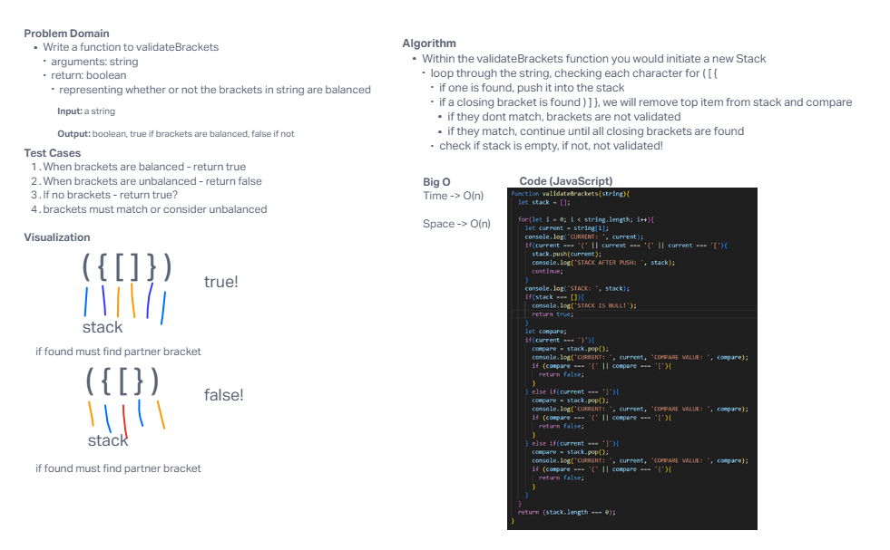

# Stacks/Queues - Brackets

Write a function called validate brackets that takes in a string and returns boolean, representing weather or not the brackets in the string are balanced. Three types of brackets `()` `[]` `{}`

## Whiteboard Process

## Approach & Efficiency
<!-- What approach did you take? Why? What is the Big O space/time for this approach? -->

I tried to take the approach of building a `for` loop to go through each letter of the string, checking it for any opening brackets. If opening brackets were found, we push it into a `Stack` to compare for later. We continue with all opening brackets until a closing bracket is found. Once a closing bracket is found, we start to `pop` off the top of the stack, comparing to each closing bracket.

## Solution
<!-- Show how to run your code, and examples of it in action -->

[Link to Code](./index.js)

The function `validateBrackets(string)` takes in a string as an argument. It then checks that string for any opening brackets, putting them into a stack to be compare with closing brackets. Once we hit closing brackets, we will pop one opening bracket off the top, checking if they match. If so, we continue. If not, false.
