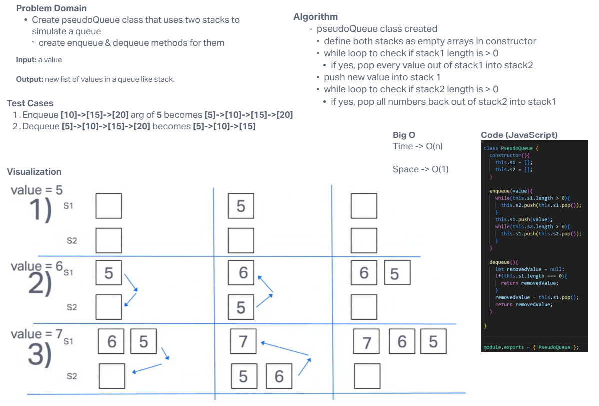

# PseudoQueue

Create a new class called `PseudoQueue` that utilzes 2 `Stack` instances to create and manage the queue. Add `enqueue` and `dequeue` methods to add and remove values.

## Whiteboard Process

## Approach & Efficiency
<!-- What approach did you take? Why? What is the Big O space/time for this approach? -->

Cisco and I had a little trouble wrapping our heads around the idea of using two `Stacks` to simulate a queue but with a little research & thinking aloud, it became clear we would essentially need to use two arrays as our "stacks" and then pop/push in and out of them. Cisco's vistualization of this problem really helped me understand (see the whiteboard!).

Big O is still a little out of my wheelhouse - I hope to understand it better before long.

## Solution
<!-- Show how to run your code, and examples of it in action -->

[Link to Code](./index.js)

Our code creates two `Stacks` each of which starts empty and then it goes through while loops to make sure each the stack is properly being added to the front instead of the back, like a traditional `push` method might do. Our `enqueue` adds a new object to the front of the stack by moving all the objects into a second stack to hold them, while the new value is added, then all the values come back into the first stack. `Dequeue` removes from the front, similar to how enqueue works.
