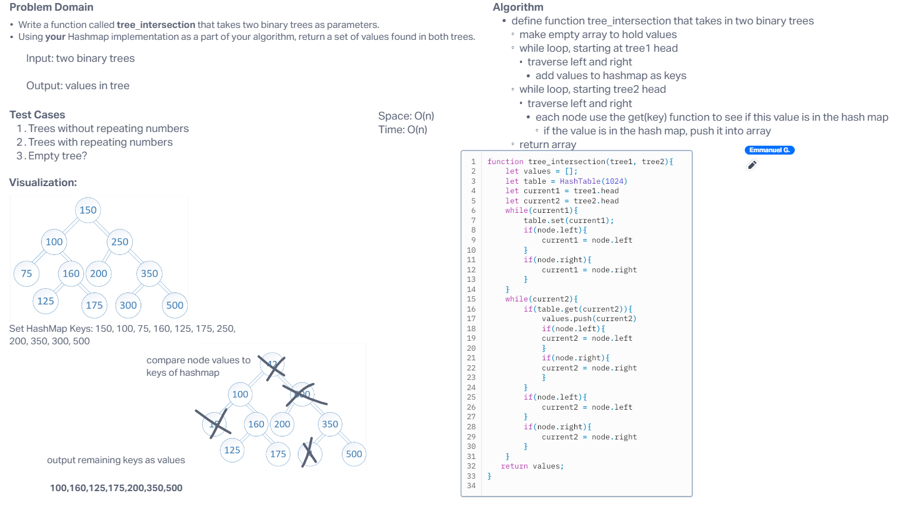

# Binary Tree Intersection

Find common values in 2 binary trees. Write a function called tree_intersection that takes two binary trees as parameters. Using your Hashmap implementation as a part of your algorithm, return a set of values found in both trees.

## Whiteboard Process

## Approach & Efficiency
<!-- What approach did you take? Why? What is the Big O space/time for this approach? -->

We took the approach of traversing through the tree, adding those numbers into the hashmap. Once into the hash map, we traverse through the second tree, comparing those values to the values within the hashmap keys. If the key matches a value of the second tree, we push it into the array. After which, return the array. This didn't work as expected and I worry there is an error in the `.set` code I have.

Time: O(n)  
Space: O(n)

## Solution
<!-- Show how to run your code, and examples of it in action -->

[Link to Code](./index.js)
