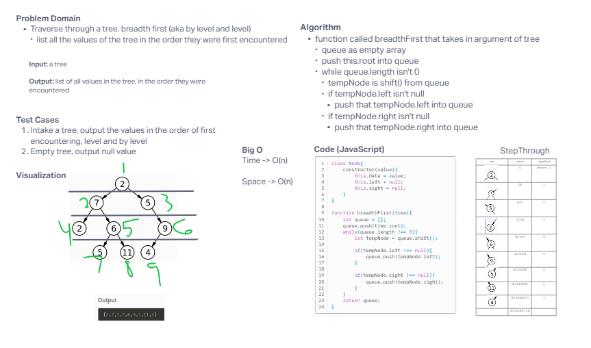

# Trees: Breadth First

Write a function called `breadthFirst` that returns a list of all values in the tree in the order they were encountered. Use the level order traversal method.

## Whiteboard Process

## Approach & Efficiency
<!-- What approach did you take? Why? What is the Big O space/time for this approach? -->

I tried to take the approach of working with the current root of the tree & then traverse left then right, then continuing to do so for each node in order of levels. I couldn't get the code to do exactly what I was hoping for, and I think thats because currently the queue doesn't take in the full tree. I'm not sure why or how to get it to work but I'm planning to revisit after some more research.

## Solution
<!-- Show how to run your code, and examples of it in action -->

[Link to Code](./index.js)
