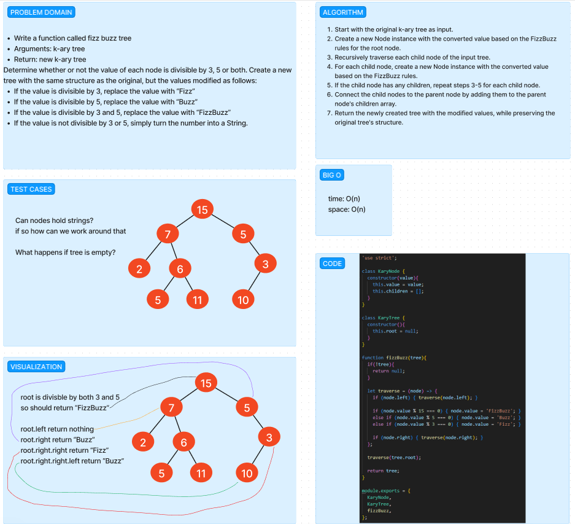

# KAryTree FizzBuzz

Write a function called fizz buzz tree
Arguments: k-ary tree
Return: new k-ary tree

If the value is divisible by 3, replace the value with “Fizz”
If the value is divisible by 5, replace the value with “Buzz”
If the value is divisible by 3 and 5, replace the value with “FizzBuzz”
If the value is not divisible by 3 or 5, simply turn the number into a String.

## Whiteboard Process

## Approach & Efficiency
<!-- What approach did you take? Why? What is the Big O space/time for this approach? -->

My approach was to step through each node by recursively checking `node.left` and `node.right`, and if the `node.value` was % by 15, `FizzBuzz` if % by 5, `Buzz` if % by 3, `Fizz`.

After that we call this function on the tree.root, stepping through each node.

## Solution
<!-- Show how to run your code, and examples of it in action -->

[Link to Code](./index.js)
