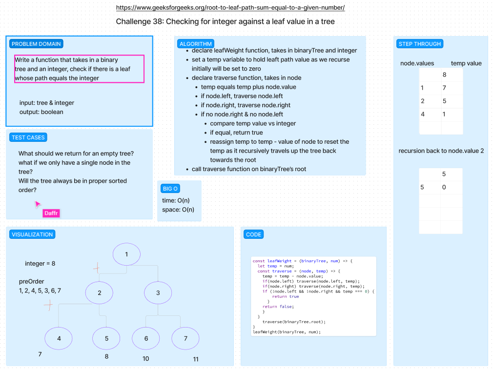

# Trees - Leaf Path Value

Given a binary tree and a number, return true if the tree has a root-to-leaf path such that adding up all the values along the path equals the given number. Return false if no such path can be found.

## Whiteboard Process

## Approach & Efficiency
<!-- What approach did you take? Why? What is the Big O space/time for this approach? -->

We tried to take the preOrder traversal approach, starting with using the integer as a temp sum & then removing the node.value. Then we would recursively call, checking node.left & node.right until we got to a leaf where there is no node.right/node.left. Afterwards we check if the temp sum is 0, and if so, we return true. If it doesn't, return false. This doesn't seem to work exactly as expected, as for some reason we get undefined. Will be revisiting this.

## Solution
<!-- Show how to run your code, and examples of it in action -->

[Link to Code](./index.js)
