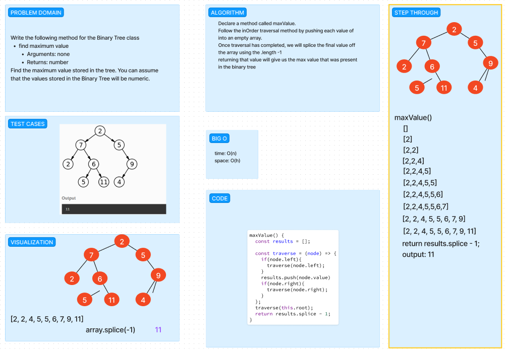

# Trees Maximum Value

Create a Binary Tree class, assuming tree only has numeric values, find the highest value using `findMax` function.

## Whiteboard Process

## Approach & Efficiency
<!-- What approach did you take? Why? What is the Big O space/time for this approach? -->

We started by using the base code for the `inOrder` and then decided to `pop()` the last item of the list, which should be in order of the lowest to highest.

## Solution
<!-- Show how to run your code, and examples of it in action -->

[Link to Code](./index.js)
