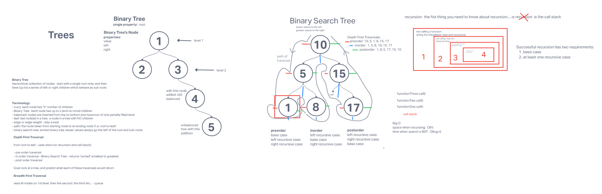

# Trees

Create a Binary Tree class, define a method for depth first traversal (`preOrder`, `inOrder`, `postOrder`) and create a Binary Search Tree sub-class for the Binary Tree class that uses the `add` and `contains` methods.

## Whiteboard Process

## Approach & Efficiency
<!-- What approach did you take? Why? What is the Big O space/time for this approach? -->

## Solution
<!-- Show how to run your code, and examples of it in action -->

[Link to Code](./index.js)
