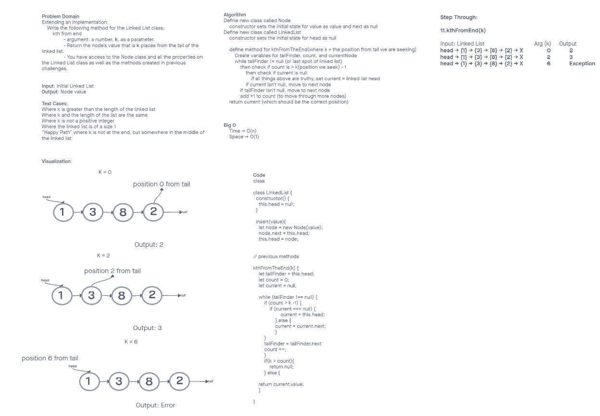

# Linked List

CHALLENGE 04: Create a `Node` class that has properties for the value stored in the Node, and a pointer to the next Node. Create a `Linked List` class. Now implement!

CHALLENGE 06: Create `append`, `insert before`, and `insert after` functions for Linked List.

CHALLENGE 07: Create `kthFromTheEnd` function that works with Linked List.

## Whiteboard Process

No whiteboard was requested for Challenge 04.

## Approach & Efficiency
<!-- What approach did you take? Why? What is the Big O space/time for this approach? -->
The approach I took was to be similar to the Traversal function we build in class demo. I reworked some of the code, once to check for any matching nodes and once to convert nodes into string.

ADDED FOR CHALLENGE 06: I used the base traversal function to get started for the append, then tried to alter it to work well with insert before/after. Ultimately I felt very confused but had Josh Coffey talk me through it which made it clear - I needed to do a lot of node hopping!

ADDED FOR CHALLENGE 07: Heather and I used the base traversal function but then added some nested loops to check for special cases & properly alter node position for each variable. Ultimately this was very complex and I'm not entirely sure we got all edge cases handled.

## Solution
<!-- Show how to run your code, and examples of it in action -->

[Link to Code](./index.js)

Our code uses several methods to work with the Linked List that was created. The linked list class connects several nodes together and the nodes hold values. The functions  created were `insert(value)` which adds another node & switches the head to that node. There is a similar function `append(value)` that will add another node to the end of the Linked List but NOT swap the head to the new node. We have another function called `includes(value)` that will seek for any nodes that include the value fed to the function. Finally we have a `toString()` function that will read out all nodes in a `"{ a } -> { b } -> { c } -> NULL"` format for human readability.

ADDED FOR CHALLENGE 06: Functions `insertBefore` and `insertAfter` do as the label on the can says - you input an pointer position & a value and then it will insert it to the appropriate node.

ADDED FOR CHALLENGE 07: Function `kthFromEnd` was added, which will intake x argument number and the find the node that is x nodes from the end of the linked list. This won't work if the argument number is too high & returns null. It doesn't work when you do negative either - it just returns the lowest position.
